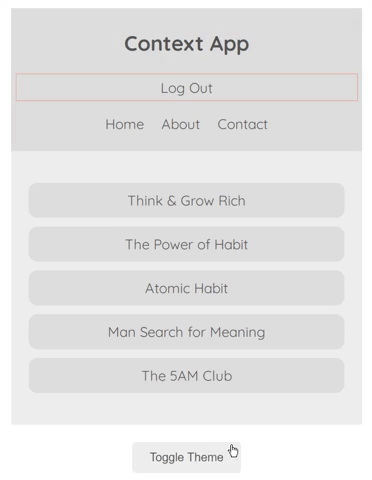

# React Multiple Context 

## Use multiple context in a single component under the component tree.

## Topic of Focus:
- Wrap up all components by the Context Provider Components
- Use { props.children } at context creating time
- Object Destructuring at receiver level components 
- Generally use sending objects from Context Provider Components

